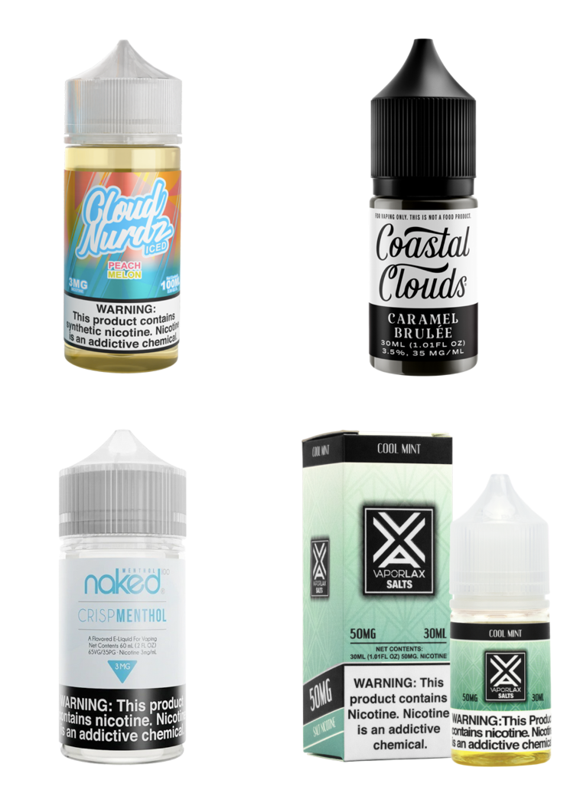
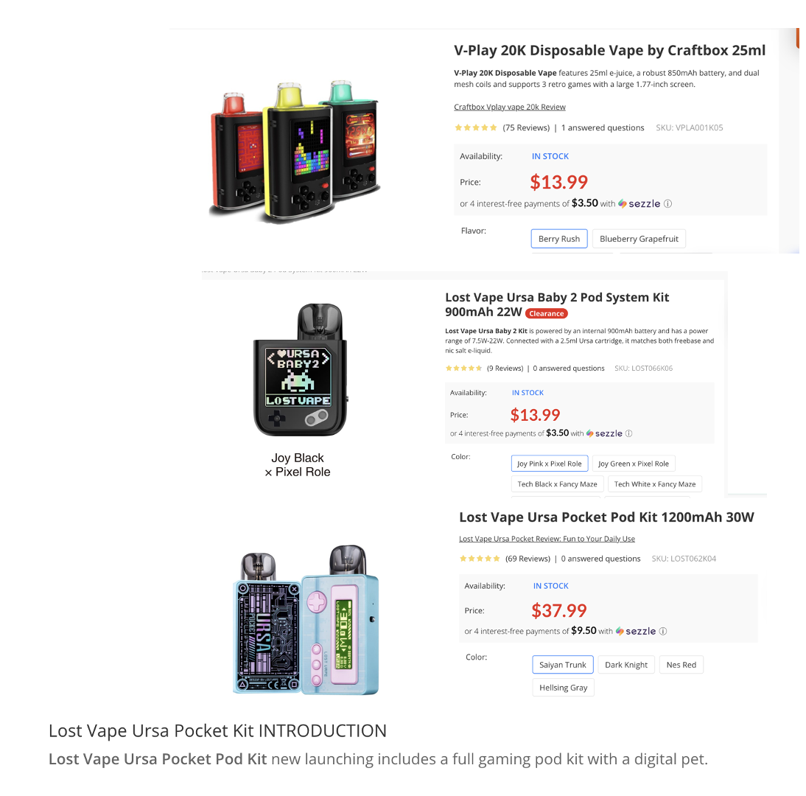

Agenda December 12, 2024 
=========================

| Updates
| Project management
| Data gathering and prep
| Unified data set is complete and will be part of deliverable
| Will update new data in this format
| CV updates
| NLP updates
| Deliverable updates

YOLO Pre-Processing Updates
===========================

| Last meeting we discussed a final model for vape detection that was
  trained on 3 separate datasets, 2 of which were web scraped and
  labeled by GTRI.
| All previous models we trained were only trained for vape detection,
  we decided to add an additional class of vape juice as these contain a
  lot of information of the brands, flavors, and nicotine content.
| We went back through previous data and re-labeled it to include
  bounding boxes for vape juices, a total of 380 vape juices were
  annotated and added to the training data.
| A new model was then trained for these two classes and used to make
  predictions on all 9 image datasets that we scraped from the web.
| This new class allows for extracting images with vape juices to be
  passed to a VLM for further processing.

VLM Examples
============

| I passed the images to the left to NVIDIAs new VLM asking the
  following question for each.
| Please give me the following information about this vape juice in a
  comma separated list. Brand name of juice, juice flavor, size of the
  bottle, nicotine content, is it a cooling flavor.
| These are the responses I received
| Cloud Nurdz, Peach Melon, 100ml, 3mg, Yes
| Coastal Clouds, Caramel Brule, 30ML (1.01FL OZ), 3.5%, 35 MG/ML, No
| Naked 100, Crisp Menthol, 60ML, 3MG, Yes
| VaporLax, cool mint, 30ml, 50mg, Yes

VLM In-Context Learning
=======================

| In context learning involves interacting with the VLM and providing it
  examples of images and corresponding responses expected.
| No re-training or tuning is done in the sense that the weights are not
  changed.
| These examples are provided to model and then unseen images are given
  to the model and it is asked to provide the same information that it
  was shown for the examples.
| Recent papers have shown that results can be significantly increased
  by providing the model as few as 40 examples of desired output.
| We are currently working on the example prompts and a test set we can
  use for testing this method.

NLP 
====

| Last time, we discussed iterative improvement of PRODUCT TYPE
  classification
| Since then, we researched different product types available for vapes
| Documentation available for review
| Notably, added an Open System class for refillable vape products (not
  disposable / closed system)
| We manually labeled >800 products for reference
| Preliminary testing using new LLM prompt shows greater accuracy with
  revised classes
| Also, how should we handle CBD products?
| Flavors
| Continuing work on vapewh, vape.com
| RegEx (pattern matching) can capture majority of flavors, but edge
  cases causing issues
| Working to set up LLM for parsing

Gaming Variable
===============

| Evaluated vapewh, vapesourcing, perfect_vape, csvape, vapingdotcom,
  vapedotcom, myvaporstore, getpop
| Only found about ~67 items (sent earlier today)
| Main themes
| Gaming features or actual games
| Built-in games, retro games, mini-games, and classic games.
| Gaming-inspired animations and game-like elements.
| Gaming-Inspired Design and Animations
| Animated screens, fidget spinners, TRON design
| Reward and Tracking Systems
| Reward systems with medals and trophies, puff counters, etc.
| We can build NLP to track these but still quite rare

Consolidating Data
==================

| Took scraped data from vapewh, vapesourcing, perfect_vape, csvape,
  vapingdotcom, vapedotcom, myvaporstore, getpop, elementvape and merged
  into one dataset
| Future datasets can be added with only tweaks to conversion file
| Process:
| Path through every csv file in data folder
| Open every file as a pandas dataframe and concatenate dataframes
| Using conversion file, smush matching columns together
| Clean up nested lists, lists of nan values, formatting data to be
  prettier
| Working on some final cleaning and code restructuring
| Final Products:
| Excel file with all products
| Excel file of columns to be blended
| Script to rerun data blending and cleanup
| Documentation on how to use the scripts and how to format incoming
  data
| Documentation on what different columns mean (95 total columns!)

Deliverable Update
==================

| Sync to github from our private gitlab is set up and will set to run
  regular updates
| Initial code is moved there
| Read The Docs setup and configured
| Requires additional permissions to run automatically, but can run
  manually
| Team is starting to migrate documentation over to that format
| https://cdcf-ecig-clean-and-analysis-project.readthedocs.io/en/latest/
| Wrap up of this part of the contract
| Wrapping up work
| Will have code, documentation, and any data delivered and sent over
  e-mail
| Will be done by EOM

