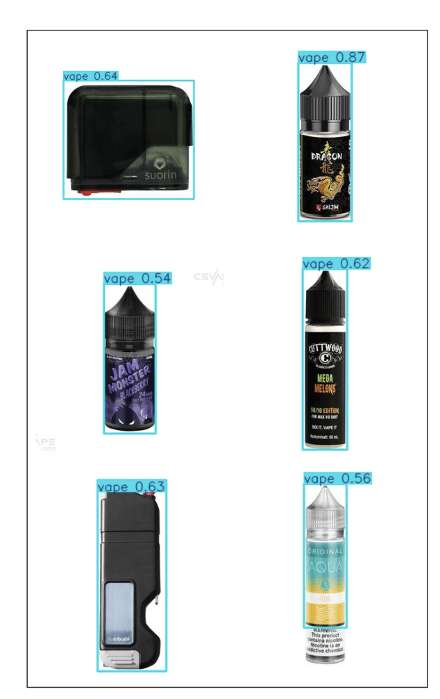

Agenda November 14, 2024 
=========================

| Updates
| Project management
| Data gathering and prep
| NLP updates
| CV updates

Data gathering and preparation
==============================

| Planning to re-run the scraping to get categories/parent links from
  the sites
| Should be done before next time
| Also working on unifying all the data into one model
| Previously only done for mipod

NLP Updates
===========

| Iteratively improved PRODUCT TYPE classification (72% -> 78%) on
  sample test set
| Main issues are disposable systems being misidentified--planning to
  emphasize "disposable" in future iterations
| Flavors
| Some sites provide structured flavors, and some do not
| Currently working on assessing those and determining best path forward
| vape.com: Set up LLM functionality for parsing due to format
  variability
| vapewh: Set up regex to parse as format is more consistent

NLP Updates SCREEN variable
===========================

| Initial scan with GPT to determine patterns around screen and displays
| Vapewh, vapesourcing, perfect vape, cs vape, vaping.com, vape.com, my
  vapor store, getpop
| Found several patterns
| Display types (LED, LCD, OLED, TFT)
| Color/colorful displays
| Touch screens
| Curved screens
| Battery and E-liquid indicators
| "Smart" displays
| Digital and HD displays
| Animated
| Backlit and Glow-in-the-dark

NLP Updates SCREEN variable
===========================

| Should be able to be identified with regular expressions now that we
  have the patterns.
| Initial regular expressions are built, need to test on larger subset.
| Need to isolate which features are most important and/or if any exist.
| Examples:
| This vape has a colorful touch screen and a battery level indicator.
| color_display: ['colorful']
| touch_screen: ['touch screen']
| battery_indicator: ['battery level']
| Features a 3D curved OLED display with e-juice indicators.
| display_type: ['OLED']
| curved_screen: ['3D curved']
| eliquid_indicator: ['e-juice']
| High-definition LED smart display screen with animation.
| display_type: ['LED']
| smart_display: ['smart']
| hd_display: ['High-definition']
| animated: ['animation']

Computer Vision Updates
=======================

YOLO Pre-Processing Updates
===========================

| Last meeting we showed the results on the My Vape Store data with and
  without tuning on a part of the dataset.
| This week we incorporated the entire My Vape Store dataset into the
  model to further improve its performance.
| To validate its performance, we labeled theCSVape data and used it as
  an unseen test set.
| This dataset contained 436 total images with 376 of these containing
  NO vapes while the remaining 60 contained at least a single vape.

YOLO Pre-Processing Updates Contd
=================================

| When used for testing the model correctly classified 427 of the 436
  images with 8 false negatives (missed vape images) and 7 false
  positives (image misclassified as having a vape).
| This translates to an image classification accuracy of 97.9%.
| For the final model we have added all theCSVape images to the full
  dataset and retrained.
| This model will be used to classify all images from 9 different
  websites that were scraped by the team to identify images with vapes
  for use by the VLM.

Deployment Options for CV Models
================================

Model Deployment Background
===========================

| After training a model, how do we make it useable?
| Model deployment the process of exposing the trained model to
  end-users for inference
| Considerations:
| Privacy
| Computational resources
| Number of requests and latency

Option 1: Push/Pull to/from Huggingface Hub 
============================================

| Pros:
| Free! All compute is done locally
| Privacy can make model visibility private
| Flexibility model can be tuned/changed if necessary
| Complexity model requires no management
| Cons:
| Compute must have access to GPU for reasonable inference speeds
| Maintenance must write your own scripts to prepare data and feed to
  model

Option 2: Cloud Services (e.g: AWS Sagemaker)
=============================================

| Pros:
| Simplicity model can be queried with a simple script like any API
| Compute can leverage cloud providers resources
| Cons:
| Flexibility model is fixed. If changes are needed, must make them
  (potentially re-training) and re-deploy
| Cost must pay for compute/memory resources
| Overkill unnecessary amount of infrastructure for only a small number
  of requests

Option 3: Huggingface Inference Endpoints
=========================================

| Pros:
| Simplicity of HF + flexibility of cloud
| HF manages cloud services as needed only pay for what you use
| Built to interface with huggingface models (where our model is built)
| Cons
| Model still lives in cloud must re-deploy to make changes
| Paid (relatively cheap, $0.5 per GPU hour)

What do we recommend:
=====================

| Inference endpoints are a simpler and more manageable version of
  AWS/GCP/Azure
| If you want flexibility and are comfortable writing code to run the
  model, the first option is likely best
| If you prefer a simpler API, inference endpoints are a better option
