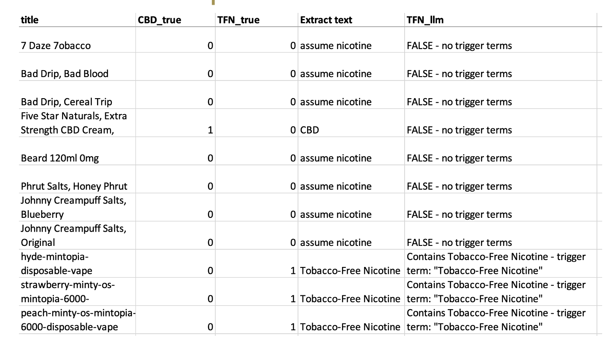
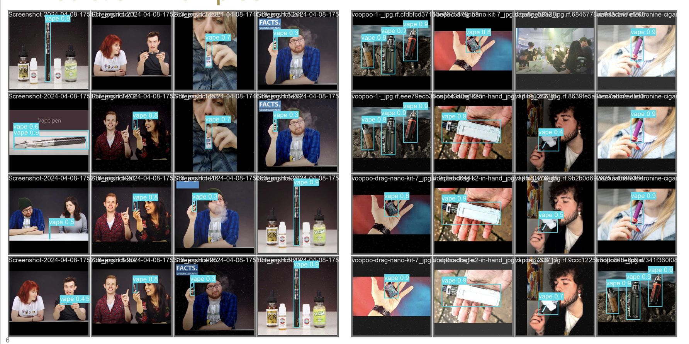
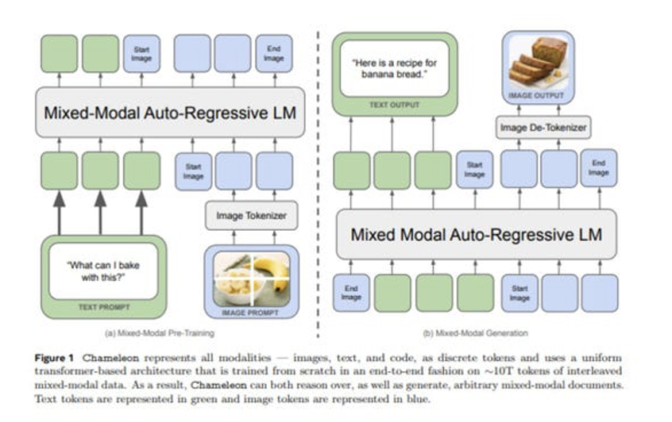

Agenda October 17, 2024 
--------------

| Updates
| Project management
| Data gathering
| ElementVape completed
| Data cleaning and prep
| Starting to look at some data cleaning/prep processes, otherwise no
  updates
| NLP
| Progress on TFN
| Image classification

NLP Updates
---------------------------

Made progress on TFN

TFN/CBD Samples
---------------------------

Computer Vision Model Updates
---------------------------

| Working on implementing pre-labeled vape data set to clean our images,
  and be able to extract non-vapes.
| Labeled and cleaned a decently sized dataset for screens (~9000)
  examples from each of the websites. Working on finetuning a model on
  this data.
| We are making some changes to our processing based on feedback from
  CDCF (separating out ICED vs. NON-ICED varieties on same product)
| Overall, is a more straightforward classification than screens so
  shouldnt be too much of a change

Image Cleaning
---------------------------

| Found a public dataset of vape images with bounding box ground truth,
  about 2100 images.
| Trained a YOLOv8 model using 80% of the data for training and 20% for
  testing.
| Preliminary performance without any parameter tuning is about 82%
  accurate in detecting vapes in images.
| Working on improving this accuracy by increasing augmentation and
  potentially adding more data points.
| Goal is to use this model to filter through all of the web scraped
  images to eliminate those that do not contain vapes as a
  pre-processing step for the VLM.

Prediction Examples
---------------------------

Background: Vision-Language Models
---------------------------

| Some vape data has a text component, a vision component, or both
| E.g: iced flavors, presence of screens, etc.
| Recent models (e.g: LlaVA, Chameleon) can ingest interleaved text and
  images
| They consist of an LLM backbone and a vision encoder/tokenizer

VLMs are strong zero-shot learners
---------------------------

| Recent VLM research has focused on zero and few shot performance on
  various tasks
| E.g: Some VLMs can answer questions about images despite never being
  trained to do so
| Pros: VLMs are very adaptive to novel tasks. We can take advantage of
  this to label data
| Cons: This can be inefficient, unreliable, and difficult to verify.
| Performance highly-dependent on choice of prompt

Our approach:
---------------------------

| Design prompts for the variables we are interested in (for now screens
  and iced)
| Use LlaVA to label a portion of the data (~10,000 examples)
| Clean the data for inaccuracies much faster than manual labeling as
  LlaVA does a decent job and errors are predictable
| Fine-tune another VLM (for now, Flava) on this clean data to achieve
  more-reliable performance

Flava is a VLM that can perform both multimodal and unimodal
vision/language tasks

Potential options:
---------------------------

| We can train the model and use it to label the vape data
| We can also deploy the model, allowing CDC groups to query in via an
  API without our involvement

Huggingface provides a free inference tool we can develop and share with
the CDC
