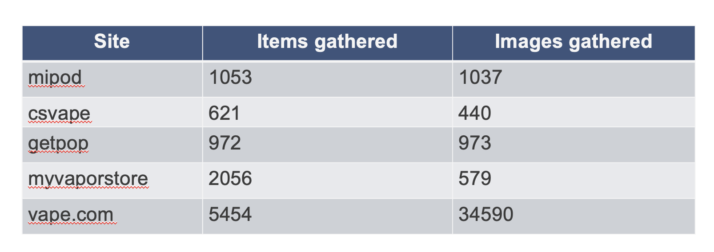
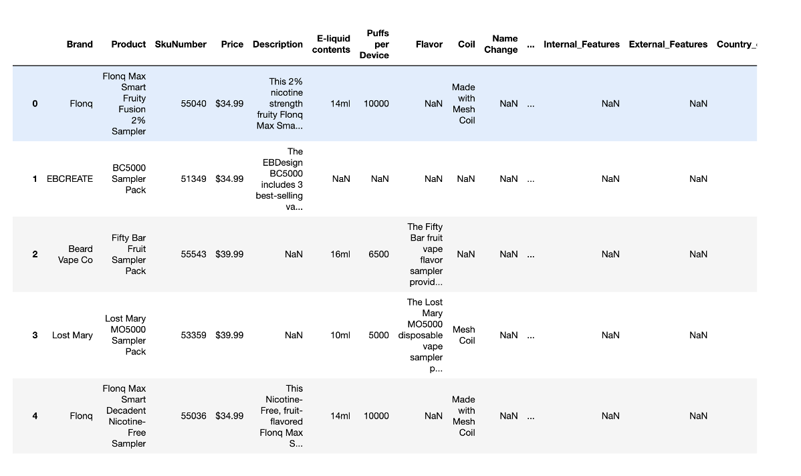

Updates - September 19, 2024 
--------------

| Updates
| Data gathering
| Data cleaning and prep
| Initial NLP efforts
| Image classification
| Project management

Data Gathering 
~~~~~~~~~~

| Trying to gather more data to have better data for models
| Mostly reusable code
| What we have so far (including provided by Elisha)
| Element Vape is TBD

Data cleaning and preparation
~~~~~~~~~~

| Organized raw mipod data into standard features and identify relevant
  subcategories
| i.e. display -> LCD screen, indicators, etc.
| Populated standard features using mipod product descriptions/extra
  columns

Data cleaning and preparation
~~~~~~~~~~

| Will standardize other data sets to this format
| Sample:

Initial NLP Efforts
~~~~~~~~~~

| Coded NLP regex to extract and populate new features using Product
  Categories document from CDCF
| Iced Variable
| Total Ounces/mL
| Nicotine Level
| Synthetic Nicotine
| Nicotine Free
| Product Type (in-progress)
| Will validate with other newly scraped data sets to test
| Next variables
| Screens, etc.
| CBD, THC variables (seems like there may be less of these now)

Image Classification
~~~~~~~~~~

| Starting with pre-trained models, fine-tuning as needed, examples:
| https://github.com/openai/CLIP
| https://llava.hliu.cc/
| Using internal HPC cluster
| VLM
| Combine classic computer vision models with large language models LLMs
| Initial testing on:
| Iced, mountains, etc.
| Screens
| Initial results are promising

