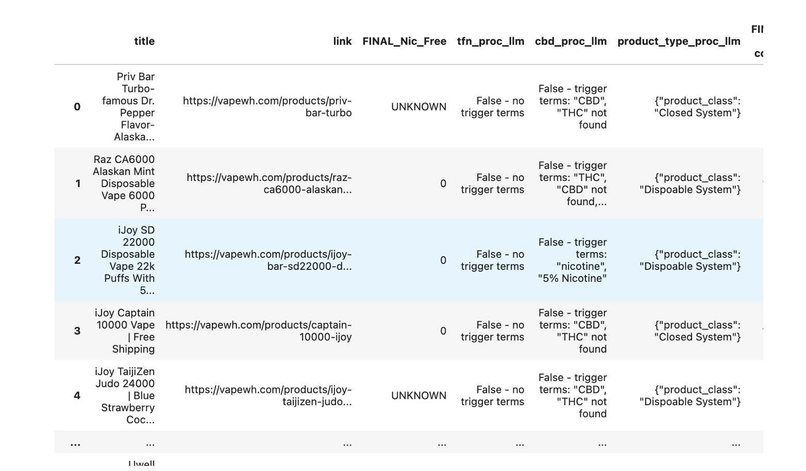
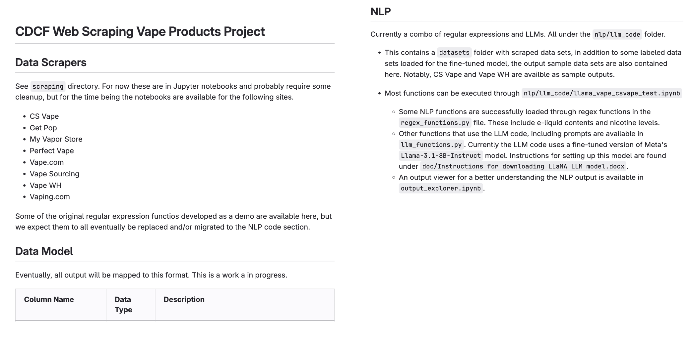
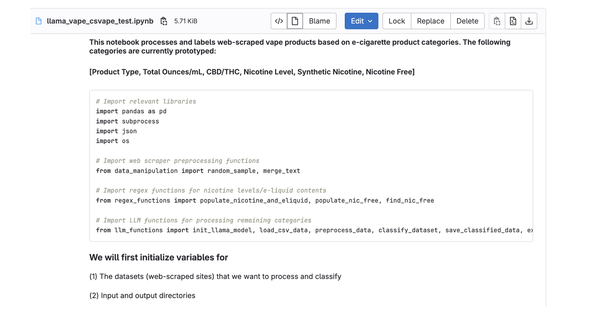
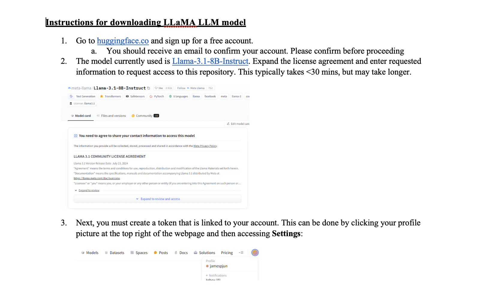
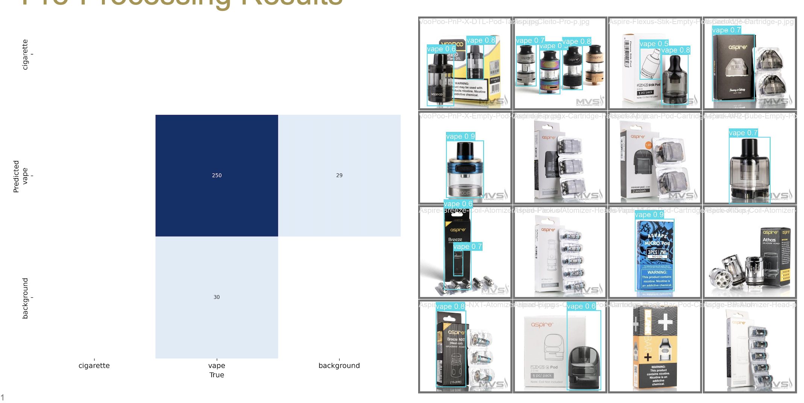
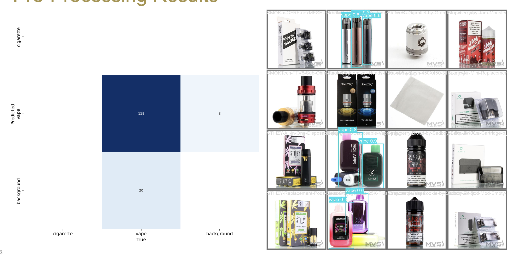

Agenda October 31, 2024 
--------------

| Updates
| Project management
| Data updates
| NLP
| Image classification

Data Updates
~~~~~~~~~~

| We established a database for storing processed data.
| It's not a strict requirement for future use, but will help us
  organize data better and could help with future analysis.
  

NLP Updates
~~~~~~~~~~

| Last meeting, we presented challenges/preliminary results on
  classification of TFN edge cases
| Since then, we have worked on developing prototypes for:
| TFN
| CBD/THC
| Product type
| Iced (text only)

NLP Results
~~~~~~~~~~

| Prototypes were tested on vapewh and csvape. Further testing will be
  performed using additional datasets.
| TFN: 90% accuracy on true TFN products
| Overall: csvape 565/566 and vapewh 360/362
| Not accounting for accessories
| CBD: Identified CBD records within datasets but too small of a sample
  (2/2)
| Need to validate this by collecting larger set of CBD products across
  other datasets
| Iced: Attempted to prompt using few-shot learning with limited success
| Further prompt engineering is needed to better guide LLM
| Product Type: Sample validation resulted in 36/50 correct (72%)
| Further prompt engineering and few-shot learning should yield
  improvements

Additional NLP Updates
~~~~~~~~~~

| Finish up 'Iced'
| Finish up 'Screens'
| Working on flavors next

Datasets
~~~~~~~~~~

Deliverable README
~~~~~~~~~~

Deliverable (initial NLP protoype)
~~~~~~~~~~

Model Setup...
~~~~~~~~~~

Image Pre-Processing Updates
~~~~~~~~~~

| Last meeting we showed results of YOLOv8 object detection on a public
  dataset of vape images.
| Since then we have tried using this model on images scraped from My
  Vape Store which contain many images of vape parts such as mouth
  pieces and other accessories.
| Using the model trained on the public dataset we tried pre-processing
  the My Vape Store data.
| Though the model performed okay, it had a lot of false positives where
  it classified vape mouth pieces as vapes.
| This is not too surprising as the network has not seen just
  mouthpieces separately and can be tuned for this issue.

Pre-Processing Results
~~~~~~~~~~

Model Re-Training
~~~~~~~~~~

| Due to the results we see in the previous slide it was clear the model
  needed to be tuned on this type of data.
| The My Vape Store dataset contained 578 images,we moved 378 of these
  into the training set so the model had some examples of vape pieces
  that are not supposed to be classified as vapes.
| The model waws re-trained and then tested on the remaining 200 images
  from the My Vape Store dataset.
| This re-training reduced the percent of both false positives and false
  negatives which can be seen on the following slide.

Pre-Processing Results
~~~~~~~~~~

Other Vision Model Work
~~~~~~~~~~

| Continueworking on fine-tuning the prompts
| Experienced some overfitting so working on that
| Have an 'iced' prompt that works fairly well
| May test out combining with the NLP model
| Also working on splitting up the flavors on data sets where all on one
  item
| Model deployment options (HuggingFace)
| Can just upload fine-tuned model and then it can be downloaded and
  used, or...
| Can deploy on Model Hub (Free and should be callable, but has some API
  limits)
| Also paid options but would require ongoing maintenance.

