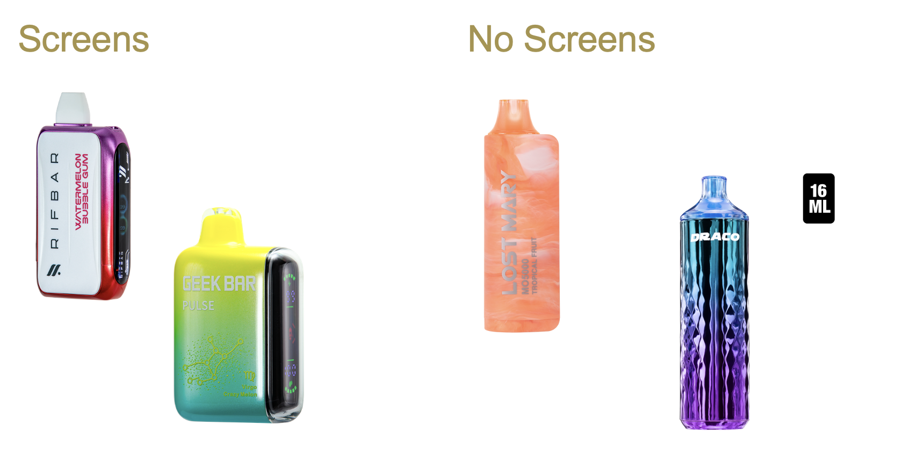

Agenda October 3, 2024 
=======================

| Updates
| New team members
| Project management
| Project timeline
| Data gathering
| Data cleaning and prep
| Initial NLP efforts
| Image classification

Agenda October 3, 2024

Data Gathering
==============

Data gathering
==============

| Finishing up elementvape
| Data and code should be available in shared folder
| Identified 30 other potential sites if needed (definitely more out
  there)

Data gathering

| https://www.huffandpuffers.com/
| https://vaporboss.com/
| https://vapordna.com/
| https://thevaporshoppeusa.com/
| https://www.flawlessvapeshop.com/
| https://www.vaporbeast.com/
| https://www.vaporfi.com/
| https://www.myvaporstore.com/
| https://www.ecigmafia.com/
| https://vaperoyalty.com/
| https://misthub.com/
| https://breazy.com/
| https://store.vaporesso.com/
| https://ejuicedirect.com/
| https://www.ecigmafia.com/
| https://www.eightvape.com/
| https://www.dashvapes.com/us/

| https://ezpuff.com/
| https://www.gopuff.com/c/tobacco-vapes-disposable-vapes/tx5RSEow
| https://www.gopuff.com/c/tobacco-vapes-reusable-vapes-juices/txYjMPOL
| https://vaporempire.com/
| https://www.vapeshack.com/
| https://juicefly.com/
| https://www.redstarvapor.com/
| https://www.ejuices.com/
| https://www.vapezilla.com/
| https://www.ejuicestore.com/
| https://www.xhalecity.com/
| https://www.vaporpuffs.com/
| https://beyondvape.com/

Data cleaning
=============

| Sticking with previous structure from last time
| Shared sample mipod data

NLP Updates
===========

| Numeric values performing well with regular expressions
| i.e. puffs per device, e-liquid contents, price, etc.
| Working on TFN/synthetic, nicotine-free, CBD/THC
| Less success when testing with new data
| Nicotine salts/freebase not being auto id'd as TFN
| Multiple nicotine values not being picked up
| Currently working on testing LLMs with fine-tuning
| Screens will be next pass

NLP Updates

Image Processing Updates
========================

Image Processing
================

| Have initial pass at "iced" and "screen"
| Going to test with additional data
| Seeing possibilities of distinguishing screen model
| Seeing if possible to improve performance and speed
| Working with a pre-existing trained model to find images of vapes (to
  filter out non-vapes, parts etc.) to filter down data set

Image Processing

Iced
====

.. image:: images/103_4.png
   :alt: iced vapes
   :width: 66%
   :align: left

Screens
=======

  
