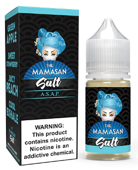
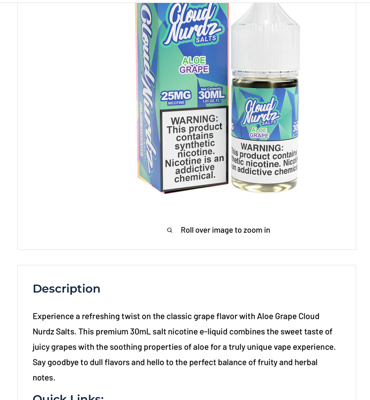

Updates - Sep 4, 2025
---------------------

Previous Response Issues
========================

* In previous experiments we have passed the web page link as part of the text within the Gemini prompt.
* The issue we were having was that the responses included information that was not from the web page given causing erroneous responses.
* We attempted to remedy this issue by adjusting the prompt to explicitly note that the model should only use the given image and web link, however, this did not solve the issue.
* Upon further investigation I found that the Gemini API has a url_context parameter that can be supplied to the model which allows Gemini to access the information on that web page.

Updated Response (Example 1)
============================

The webpage content confirms the product name "A.S.A.P. (Apple Peach Strawberry) by The Mamasan Salts Series | 30mL".
The "Description" section states: "A.S.A.P. by The Mamasan Salts Series offers a unique blend of green apple, sweet strawberry, and peach for a delightful vaping experience. Its 30mL bottle packs a punch of flavor and satisfaction with every hit. Bring summer to life with this bold and delicious combo."
Under "Flavors:", it lists: "A.S.A.P. (Apple Peach Strawberry) – Green Apple | Sweet Strawberry | Peach".

However, the key information is from the *image* on the product box itself, which clearly states "COOL EXHALE". The criteria state: "If the box and/or advertisement images contain ice imagery (ice cubes, snowflakes, or associated winterized imagery, etc.) = Yes." While "COOL EXHALE" isn't strictly "ice imagery" like snowflakes, it's a direct textual indication of a cooling effect *on the product's packaging*. This should be sufficient to classify it as having a cooling effect based on the spirit of the guidelines, especially the part about "cooling suggestion" in the name or "terminology present in review." The "COOL EXHALE" is on the box, which is an advertisement image.

Let's re-evaluate the "COOL EXHALE" in context of the rules.
1.  **Product flavor name contains cooling suggestion:** "A.S.A.P. Apple Peach Strawberry" does not.
2.  **Box and/or advertisement images contain ice imagery:** The image shows "COOL EXHALE" on the side of the box. While not "ice cubes" or "snowflakes," "COOL EXHALE" is a direct descriptor of a cooling sensation on the product packaging. This is an explicit textual indication of a cooling effect presented visually on the product itself. I will interpret "associated winterized imagery, etc." broadly to include explicit textual claims of coolness on the packaging, as it directly describes the sensory experience the product provides.

If "COOL EXHALE" is not considered "ice imagery" or an "associated winterized imagery," then I would move to "Locate flavor review for the searched product." The provided webpage does not contain customer reviews or a dedicated "flavor review" section, only a product description which doesn't mention "cool" or "ice" terms other than the *image itself*.

Given "COOL EXHALE" is visually present on the product box, it's a clear indication. The rules don't strictly define "ice imagery" as *only* visual metaphors, but also include "cooling suggestion" in the name or "terminology present in review". "COOL EXHALE" is terminology present on the packaging itself.

Therefore, the "COOL EXHALE" on the box is the strongest indicator. Yes - The product packaging (box) explicitly states "COOL EXHALE," which indicates the presence of a cooling effect.

Updated Response (Example 2)
============================

Yes - The product description for "Aloe Grape" on the webpage states "Experience a refreshing twist on the classic grape flavor with Aloe Grape Cloud Nurdz Salts" and describes the flavor as "Refreshing aloe vera blended with sweet and juicy grapes". The term "refreshing" suggests a cooling sensation, which aligns with the evaluation criteria to identify terms like "cooling sensation" or "cool".

VLM Analysis - First 150 Products 
=====================================

* Using this new prompt procedure, I evaluated the performance on 150 products to determine the accuracy and quality of the responses.
* This set of responses did not reference any outside sources other than the image and web page provided, fixing that previous issue.
* Out of the 150 products verified, 143 of them were predicted correctly, resulting in 95% accuracy.
* There are some similar errors in the incorrectly predicted products.

Incorrectly Predicted Products
==============================

* 1 of the responses indicated it “need to access the web page” for further information.
    * I am not sure why it was not able to access the web page, we can add a check to see if the web page is accessible by the model before reporting results.
* 3 of the responses indicated that the word “refreshing” indicated a cooling flavor.
    * This is not always the case and is not part of the criteria, we might clarify this in the prompt.
* 2 of the responses indicate that “menthol” is in the web page tags.
    * The word menthol is not present on the user end of the web page, however when you look at the page source, the page has tags that include the word menthol.
    * These tags appear to be for search criteria, not sure how to handle these.
* 1 of the responses indicated that “iced tea” indicates a cooling flavor
    * This flavor is described as “a blast of raspberry iced tea with an apple straight off the tree”, this does not seem to be a cooling flavor but does have the word “iced” in the description, although the context is iced tea.

Next Steps
==========

* Added a check to determine if the model can access the web page before we output the results.
* Added temperature parameter to control how “creative” the model is, this reduces its creativity and may provide stricter adherence to the criteria given.
* I will re-run the 150 samples and re-evaluate before we proceed to a larger sample size.

NLP Updates
===========

* Finishing up modularizing code for future analyses 
    * Converting existing analysis to exploratory Jupyter Notebook for team to use
* Working on date analysis 
    * Will send email update to CDC team by end of week
* Sent over unique brands within scraped database with associated counts
    * Any concerns or questions?
* "Other Flavor" subcategory follow-up from last week
    * Any thoughts on organizing this category further?
* NLP concept proposal
    * Scope of analyses
    * Could we integrate multiple concepts (i.e. highlights from achievements) into 1 concept proposal or should we keep ideas separate?

