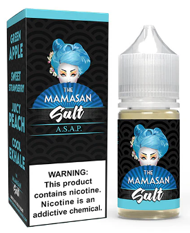
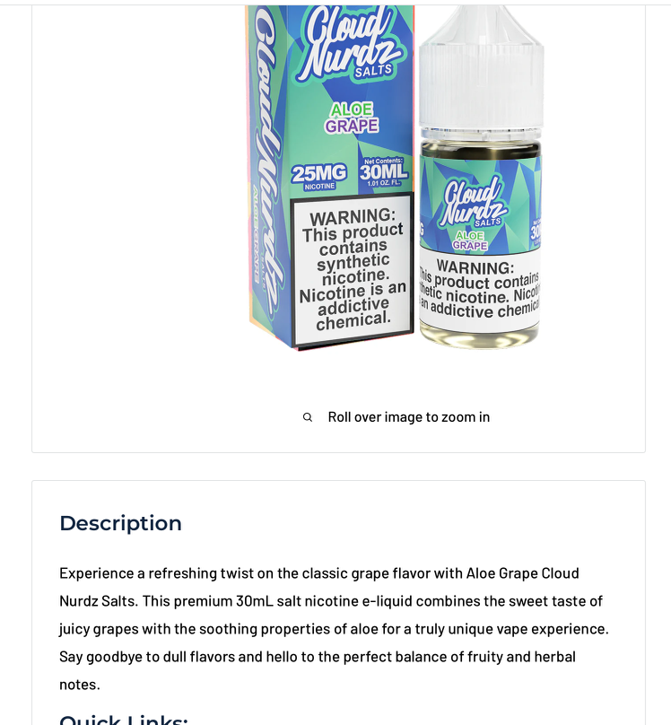

Updates - Oct 2, 2025
---------------------

CV Updates
==========

* In our last meeting I showed some examples of incorrect predictions by the VLM due to various ambiguities in the prompt.
	* An example is the word cool or iced appears within the image but not in website description.
* I made modifications to the prompt to specifically clear up these ambiguities and provide more specific instructions on making a determination. 
* I also lowered the temperature parameter of the model, making it less creative and more consistent in its responses.
* I evaluated the first 200 samples manually and only found a single incorrect prediction.

VLM Prompt Changes
==================

I want you to role play as a Center for Disease Control expert in e-cigarette products. You will be evaluating e-cigarette products to determine if they contain a cooling effect, also known as iced. 

I want you to use the following criteria to evaluate e-cigarette products:

All flavors can be “iced”; that is, the presence of cooling chemical additives that are not the primary flavoring. Many require flavor reviews to confirm, as it is not always evident in the product name. For example, mint ice is most likely a mint flavored product with a cooling sensation, but it may also occasionally be a menthol flavored product.

If the product flavor name contains cooling suggestion (e.g. Strawberry Ice, Frozen Mint, Cool Watermelon, Chill Mint, etc) = Yes.

	IF NAME DOESN’T INDICATE ICE:   
		If the box and/or advertisement images contain ice imagery (ice cubes, snowflakes, or associated winterized imagery, etc.) = Yes.
		If the box and/or advertisement images contain text that suggest cooling (e.g. Cool Exhale, Iced, Cooling, etc.) = Yes.

	IF IMAGERY DOES NOT INDICATE COOLING PRESENT: 
		Locate flavor review for the searched product. 
		Identify if review mentions any “icy”, “menthol”, “iced”, “cooling sensation”, “chill”, “chilling”, “cool”, etc. 
		If review mentions above terminology = Yes.

	IF NO TERMINOLOGY PRESENT IN REVIEW: 
              If no indication of ice is available after flavor name, imagery, and flavor review search = No 
              NOTE: Flavors like “Strawberry Ice Cream”, “Slushie”, etc. and terms like "Refreshing" don’t always mean that the flavor is iced. For such 			cases, please look for an indication of coolness in the flavor review, description, or product imagery. Similarly, Mint flavors aren’t always 				iced unless specified in the name (like “Cool Mint”, “Ice Mint”, etc.) or in the flavor review (“ex: mint with a cooling finish”.

I have provided you a product image, the webpage for this product is: {} Please use only the image and the webpage to determine if this product produces a cooling effect based on the criteria given, do not use any of the web page search tags as they are not always accurate.

Do not use any additional websites or sources to make your determination than those given.

Please provide responses in the following format: yes or no - reason for answer

VLM Response Changes
====================

* Previously the model read the text from the box and was not sure that it indicated cooling as the prompt did not mention anything about text in the image.
* With the updated prompt, we now get the following response:
	* Yes - The product image clearly displays the text "COOL EXHALE" on the side of the box, which suggests a cooling effect according to the provided criteria.

VLM Response Changes (continued)
================================

* Using the original prompt the model responded with:
	* Yes - The term "refreshing" suggests a cooling sensation, which aligns with the evaluation criteria to identify terms like "cooling sensation" or "cool".
* With the updated prompt we now get the following:
	* No - The product name "Aloe Grape" does not contain cooling suggestions. The product image does not display any ice imagery or text indicating a cooling effect. While the product description mentions "Refreshing aloe vera blended with sweet and juicy grapes," the guidelines state that "Refreshing" alone does not confirm a cooling effect and requires further indication in a flavor review, description, or product imagery. No such further indication of a cooling sensation (e.g., "icy," "menthol," "iced," "cooling sensation," "chill," or "chilling") is present in the description or available reviews on the webpage.

Additional VLM Updates
======================

* I have addressed the issue of the model not being able to access the webpage, this appears to happen with some pages despite being on the same website.
	* To combat this, I have implemented a check, if the webpage was not able to be accessed by the model, the output indicates that only the image was used for determination. 
	* This notifies users that the prediction maybe less accurate due to lack of information.
	* We can either discount these in the final analysis or place them into a separate category within the results.
* As stated previously, using the new prompt we only had a single incorrect prediction out of the first 200 products evaluated.
* With these results, I am confident in moving forward in evaluating a larger sample to have statistically significant results to report.

NLP Updates
===========

* Concept Proposal
	* Updated technical details for NLP Flavors
	* Exclude/include Gap Analysis

* Developed code to subcategorize Other Flavor categories based on survey question
	* 8150 products marked as Other Flavors
	* Preliminary results show:
		* 6389 as Fruit
		* 1072 as Candy/Desserts
		* 681 as Other (non-identifiable)
			* Most of these 
		* 8 as Chocolate
	* Currently working on validation of labeling; may also need to reformat prompt as LLM may be overemphasizing fruit

