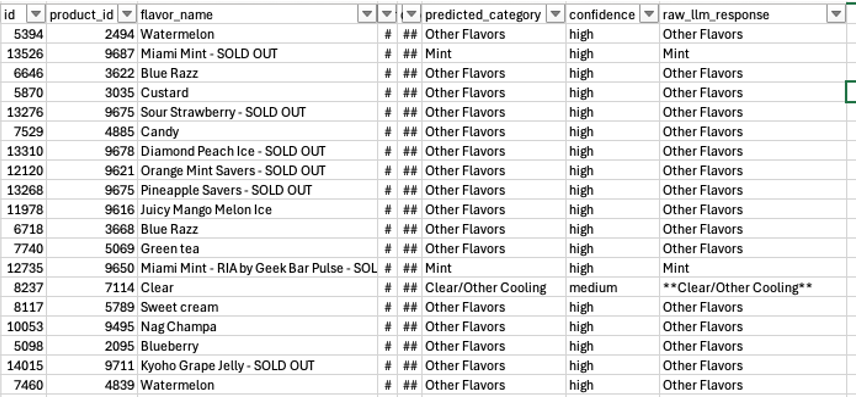
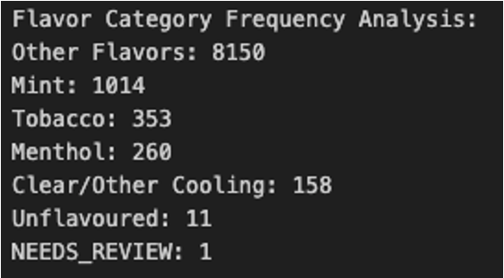
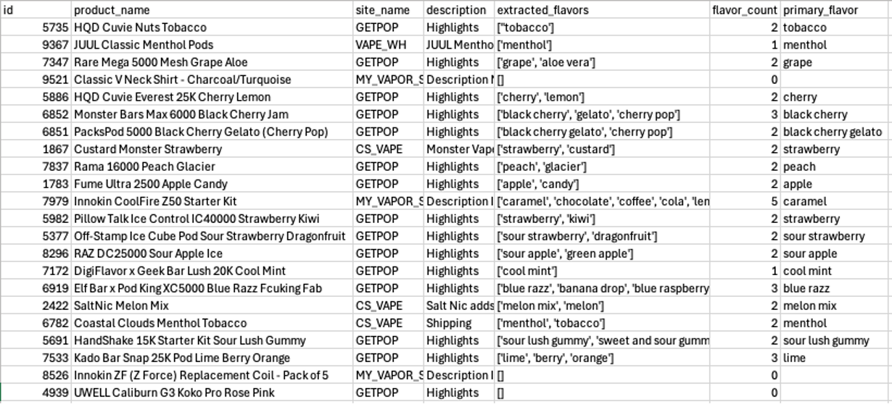
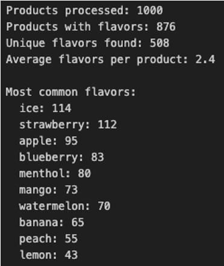

Updates - Sep 4, 2025
---------------------

e-Cigarette Screen Paper Draft Progress
=======================================

* The first draft of the screen detection paper is almost complete.
* We have completed the content for the Methods and Results sections.
* Additionally we have contributed some content to the Introduction and Conclusion, feedback from CDC would be helpful to better craft the public health impact of the work.
* One issue we are having is adding captions or descriptions to figures / tables, we do not see how to do this in SharePoint.
* Feel free to review and provide comments or edits as you see fit.

e-Cigarette Juice Cooling Flavor Detection
==========================================

* In our previous meeting we showed a small test set of e-cigarette juices that were analyzed by Google Gemini for the presence of cooling with excellent performance.
* Since then we have expanded the number of products processed and have begun the verification process.
* Although the performance has been very high (~99%) we have noticed some small issues we are trying to work on.
    * Gemini will use other sources besides the website provided and give a response with that information but no citation as to where it found that information.
    * We have tried to make the prompt explicit to only use the given source but that still does not seem to work.
    * The issue we have is that LLMs and VLMs can have hallucinations and make up information that does not exist, if it is using "sources" other than what we provide without citing them we cannot verify that information really exists.
* We are tackling this issue by trying to re-format the prompt such that the URL is passed as a defined argument to the model and not simply embedded in the text of the prompt.

Gap Analysis of Brand Franchises
================================

* Last update after push to the Azure DB 
    * 585/949 brand franchises in Circana not found in our data
    * 401 brand franchises in our data that aren't found in Circana
    * In our Azure DB, we now have 1,273 distinct brands as reference list
        * Each brand is mapped to common aliases (1,594 unique brands including aliases)
* Efforts to map flavor categories should provide more granular data on product by product mapping 

NLP Updates
===========

* Flavor Categorization
    * 91% accuracy on categorizing flavor names (n=200) into Tobacco, Mint, Menthol, Other Flavors, Unflavored, Clear/Other Cooling, Wellness/Health
    * Working to expand validation to identify any niche product names
    * Working on prompting LLM to use the "NEEDS REVIEW" category if confidence is lower
    * We also need to incorporate flavor description—working on extracting that data.
* Question: Do we want LLM to mark multiple flavor categories if present? i.e. Miami Mint is citrus + mint but default to mint.

Flavor extraction
=================

* 93% accuracy on extracting flavor names/profiles (n=100 evenly from all 4 sources) from product name and description
* LLM was also able to verify if item does not have any flavors (t-shirt, coils, etc.)
* Extracted flavors should streamline categorization for unstructured data

