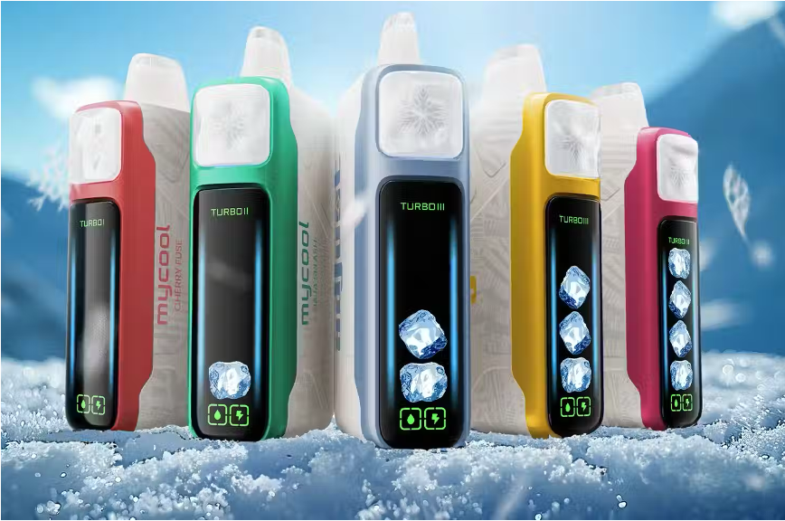
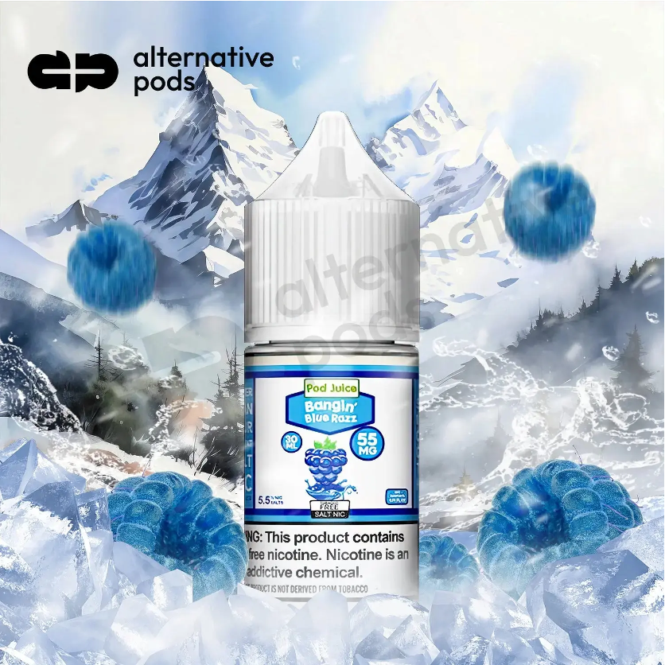
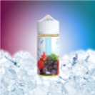
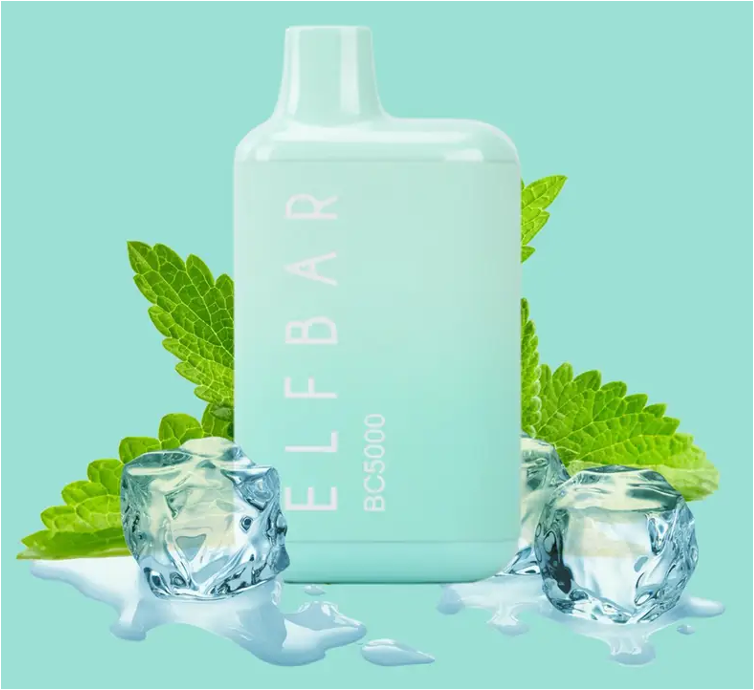
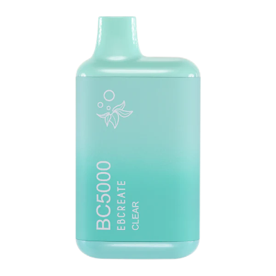
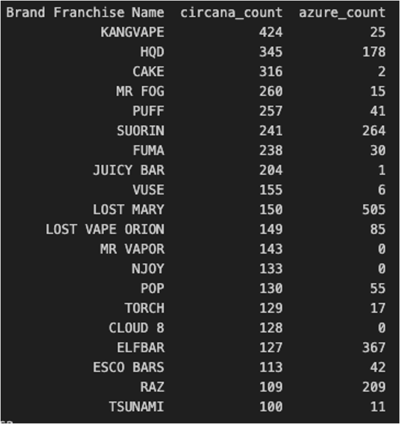

Updates - Aug 7, 2025
---------------------

Example e-Cigarette Images for Cooling Detection
================================================

* Question: Based on this image of a e-cigarette, does it have a cooling sensation. If so, why do you think that?
* Answer: Based on this image, it is highly probable that the e-cigarette has a cooling sensation. Here's why:
    * Snow and Ice: The e-cigarettes are shown resting in a snowy, icy landscape. The background features snow-covered mountains and a bright, cold sky. This setting directly communicates the concept of coldness.
    * Ice Cube Graphics: The central e-cigarette devices have screens that display images of ice cubes, some with visible condensation. This is a very direct and explicit way of associating the product with a cooling sensation.
    * "Mycool" Branding: The brand name "mycool" is prominently featured on the e-cigarettes. This name is a clear and direct indicator of the product's intended experience.
    * Snowflake Icon: The mouthpiece of the e-cigarettes features a snowflake icon, which is another universal symbol for cold and ice.
    * "Turbo" and "Turbo III": While not directly related to cooling, the "Turbo" designation suggests a strong or intense experience, which could imply a powerful blast of a cooling flavor.
* All these visual cues work together to create a strong marketing message that this product is designed to deliver a cold, refreshing, or "icy" sensation.

Example Image
=============

* Question: Based on this image of a e-cigarette, does it have a cooling sensation. If so, why do you think that?
* Answer: Based on this image, it is highly likely that this e-cigarette juice has a cooling sensation. Here's why:
    * Icy Landscape: The e-liquid bottle is placed in a setting of what appears to be ice, snow, and large, jagged ice formations. The background features snowy mountains, creating a cold, arctic atmosphere.
    * "Bangin' Blue Razz" with Ice: The product name is "Bangin' Blue Razz." While "Blue Razz" refers to a raspberry flavor, the visual presentation of it submerged in ice and surrounded by a cold environment strongly suggests an "iced" or "menthol" version of that flavor.
    * Blueberries/Raspberries in an Icy State: The blue, fuzzy fruits surrounding the bottle are depicted in a way that makes them look frozen or covered in frost. This reinforces the idea that the flavor is cold.
    * Alternative Pods Logo: The "alternative pods" logo, while not directly related to cooling, is placed in a way that adds to the overall theme of the image, which is a cold and crisp environment.
    * The combination of the icy setting, the frozen-looking fruits, and the overall cold color palette are all marketing signals used to convey a cool, refreshing, or "iced" e-cigarette flavor.

Example Image
=============

* Question: Based on this image of a e-cigarette juice, does it have a cooling sensation. If so, why do you think that?
* Answer: Based on this image, it is highly likely that this e-cigarette juice has a cooling sensation. Here's why:
    * "ICE" in the Brand Name: The brand name on the bottle is "SKWEZED ICE." The word "ICE" is a direct and unambiguous indicator of a cooling, menthol, or icy sensation.
    * Ice Cubes: The bottle is presented submerged in a bed of large, clear ice cubes. This is a very common marketing technique to visually associate a product with coldness and a cooling effect.
    * Frost/Ice on the Bottle Label: The label itself has graphics of ice cubes and what appears to be frost or icy textures, further reinforcing the theme.
    * Mixed Berries and Ice: The combination of "Mixed Berries" and "ICE" in the branding indicates that it is a fruity flavor with an added cooling element, often achieved with menthol or a similar additive.
    * Cool Color Palette: While the background has some warmer tones, the dominant visual elements (the ice, the blue colors on the label) all contribute to a feeling of cold and refreshment.
    * All of these elements collectively create a strong and clear marketing message that this e-liquid is designed to provide a cool, icy, or mentholated experience.

Example Image
=============

* Question: Based on this image of a e-cigarette, does it have a cooling sensation. If so, why do you think that?
* Answer: Based on the image, it is highly likely that this e-cigarette has a cooling sensation. Here's why:
    * Ice Cubes: The most prominent visual cue is the inclusion of ice cubes. Ice is universally associated with cold and cooling sensations.
    * Mint Leaves: The green leaves surrounding the e-cigarette are clearly mint leaves. Mint flavor is a very common addition to e-liquids and is known to provide a refreshing and cooling feeling in the throat and mouth.
    * Color Palette: The e-cigarette device itself is a pale, cool shade of blue-green, and the background is a soft, light blue. This color scheme reinforces the theme of coolness and freshness.
    * Melted Water: The small puddles of water around the ice cubes suggest that the ice is melting, which further emphasizes the cold temperature.
    * These elements are all classic marketing tools used to convey a "cool," "fresh," or "icy" flavor profile, strongly suggesting a cooling sensation when used.

Control Image
=============

* Question: Based on this image of a e-cigarette, does it have a cooling sensation. If so, why do you think that?
* Answer: Based on this image alone, it is not possible to definitively say whether this e-cigarette has a cooling sensation.
    * Unlike the other images you provided, this one lacks explicit visual marketing cues like ice cubes, snowflakes, mint leaves, or "ice" in the name. Therefore, while the color and flavor name might hint at a cooling sensation, it is not as conclusive as the previous examples. A more informed opinion would require additional information, such as the full product name or a description of its flavor.

Gap Analysis of Brands
======================

* Email update sent on 7/25 for gap analysis with Azure database
* Since then, expanded preliminary analysis to scraped sources not in Azure
    * 18,029 total raw products scraped (including Azure)
        * 8,858 of these were matched to a brand/franchise
        * 9,171 of these were not matched
    * Out of 1,475 total brands in Circana, 965 were not matched in scraped sources
    * Out of 949 total franchises in Circana, 599 were not matched in scraped sources

* The top unmatched brands in Circana remain the same despite expansion
    * Cake, HQD, Cloud 8, Kange-Cigarette Onee Stick, EscoBars, NJoy, Flying Monkey, Loon Maxx, JUUL, Lost e-Cigarette Orion
    * The bolded are primarily e-cigarette products. Unbolded primarily sell CBD/THC/Delta-8.

Gap Analysis of Brands  
======================

* Looking at franchises provides more information
    * We are getting hits on most franchises, just not all brands
    * After researching a handful of missed brands, noticed some of them have also been added to sites we already scraped
    * Some may be stored differently in our scraped data and need to be preprocessed (edge cases)
    * Some may have been discontinued
        * i.e. NJOY case and desist
    * Some may just be ignored (i.e. Cake, Cloud 8, Tsunami are THC/CBD-based)

Next Steps
==========

* Manually parsing through the scraped data gap to build a brand list repository
    * Help organize our database and assist with future mapping / de-duplication efforts as we continue scraping data
    * Finished CSe-Cigarette/Vaping.com, working on e-CigaretteWH now

NLP Concept Proposal
====================

* Preliminary literature review showed NLP + vaping largely focused on social media as a critical surveillance platform (Instagram, Reddit, Twitter/X, Tiktok)
    * Also investigate literature review to see trends 
    * Focused on marketing strategies, youth engagement, valence/motivation to quit
* A clean, publicly available dataset could offer researchers training/reference data to better track trends in online discussion
    * Potentially could see if intersection exists between popular e-cigarettes and availability of those e-cigarettes at major online vendors
    * Could also see if product attributes drive user behavior (i.e. iced / specific flavors / screens / etc.)

