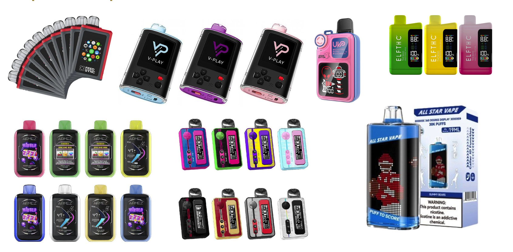
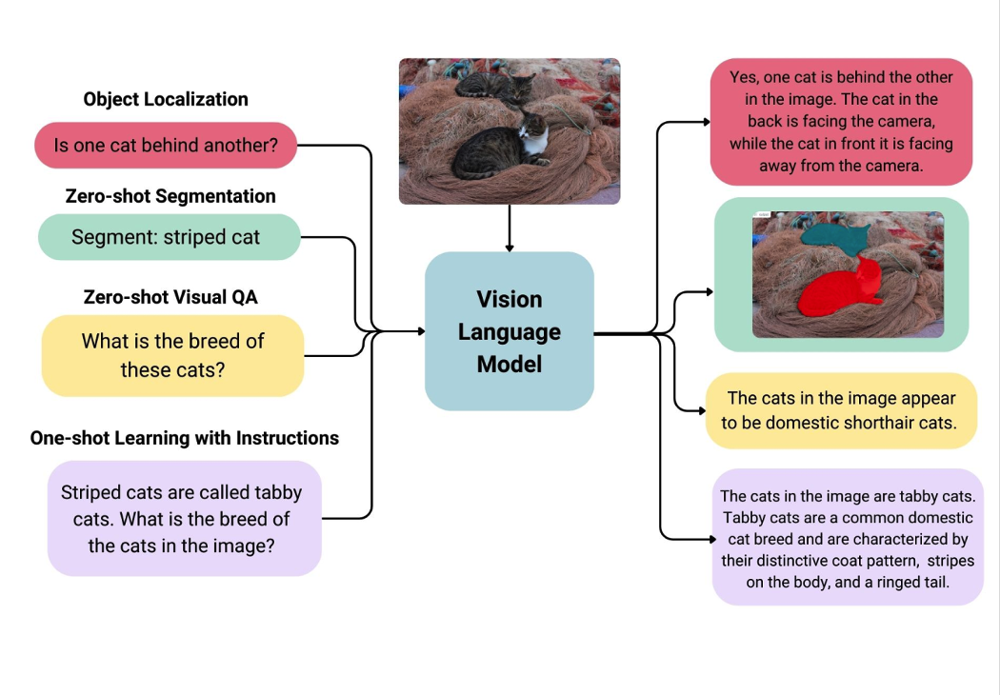
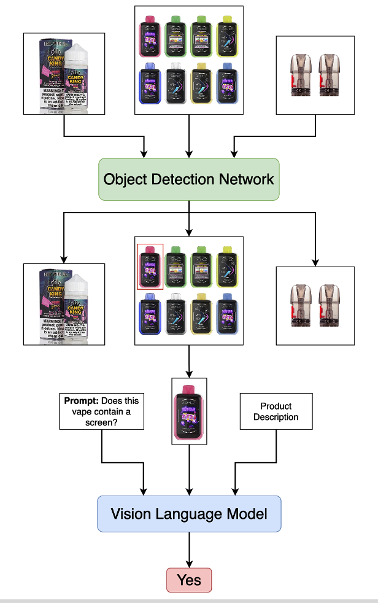
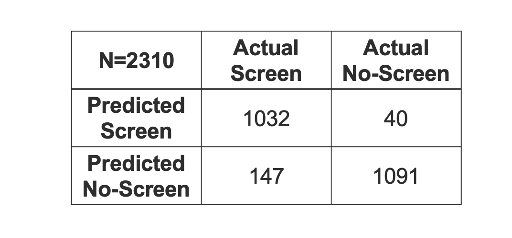

Automatic Detection of e-Cigarette Screens Using Artificial Intelligence Concept Proposal - July 2025
----------------------------------------------------------------------------------------------

Background
==========

* The e-cigarette market is rampant with products to get teens and young adults addicted.
* In recent years screens have been added to e-cigarette products to increase their use and attract a younger audience who grew up with technology.
* The goal of this research was to automatically detect these types of e-cigarettes in the vast amount of product images and descriptions scraped from e-cigarettes store websites.
* Our novel approach uses both Convolutional Neural Networks (CNNs) and Vision Language Models (VLMs) to first detect and then classify e-cigarettes based on screen presence.

Overview of e-Cigarette Screens
===============================

* e-Cigarette Examples

Vision Language Models
======================

* A vision language model is a type of artificial intelligence (AI) that can understand and process both images (vision) and text (language) at the same time.
* These models are useful for tasks like describing what's in a picture using words (called image captioning), understanding written questions about images (called visual question answering), and translating visual information into text or vice versa.

Data Processing Pipeline
========================

* Images and descriptions are scraped from various websites such as My Vapor Store and Mipod.
* An object detection model was trained to detect e-cigarettes within the scraped images and provide a bounding box of the most confidently predicted e-cigarettes.
* This bounding box is used to crop the image around a single e-cigarette for further processing.
* The cropped image as well as the description (if available) is passed to a Vision Language model (VLM), the the VLM is prompted to use the text and/or image to determine if a screen is present on the e-cigarettes.

Screen Detection Results
========================

* Accuracy = 0.92 
* Precision = 0.96
* Recall = 0.88
* F1 score = 0.92

